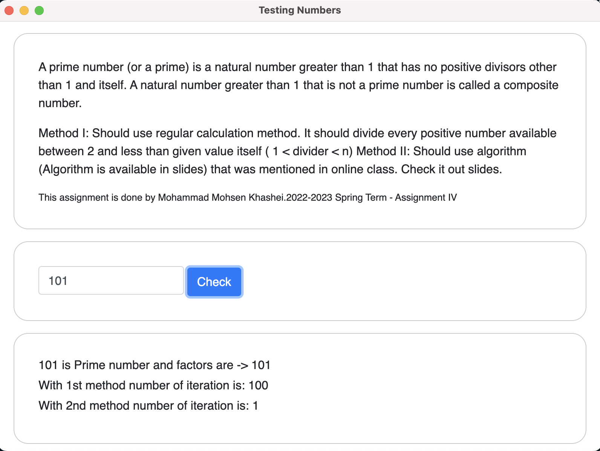

# Testing Numbers

A prime number (or a prime) is a natural number greater than 1 that has no positive divisors other than 1 and itself. A natural number greater than 1 that is not a prime number is called a composite number.

## Demo



## Files structure

- `package.json` - Points to the app's main file and lists its details and dependencies.
- `main.js` - Starts the app and creates a browser window to render HTML. This is the app's **main process**.
- `index.html` - A web page to render. This is the app's **renderer process**.
- `preload.js` - A content script that runs before the renderer process loads.
- `core/tools/index.js` - Is the handler between Electron and NodeJS with core data.

## For Use

Due to limitation of github, uploaded the executable files [here](https://drive.google.com/drive/folders/1kTW6b1K81dIhN5jSJBa9X8Opkrw2YDjK?usp=sharing) you can download the executable files for your OS. <br />
`.dmg` for mac <br />
`.AppImage` for linux <br />
`.exe` for windows <br />

## For Developing

To clone and run this repository you'll need [Git](https://git-scm.com) and [Node.js](https://nodejs.org/en/download/) (which comes with [npm](http://npmjs.com)) installed on your computer. From your command line:

```bash
# Clone this repository
git clone https://github.com/mohsenkhashei/projectNumberTesting
# Go into the repository
cd projectNumberTesting
# Install dependencies
npm install
# Run the app
npm start
```

Note: If you're using Linux Bash for Windows, [see this guide](https://www.howtogeek.com/261575/how-to-run-graphical-linux-desktop-applications-from-windows-10s-bash-shell/) or use `node` from the command prompt.

## For Packaging

```bash
# generating mac version
npm run build:mac
# generating linux version
npm run build:linux
# generating windows version
npm run build:win
```

Note: If you want to generate other versions for each OS [see this guide](https://www.electron.build)

- Electron
- NodeJS
- JAVASCRIPT
- HTML
- CSS

## Authors

- [@mohsenkhashei](https://www.github.com/mohsenkhashei)
